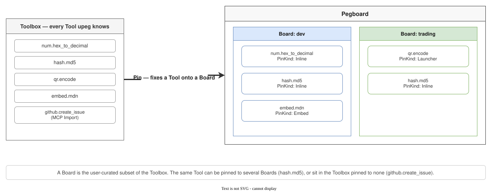

# Rules

**One word per concept, identical across every surface.** UI labels, CLI output,
TOML keys, Rust symbols, and JSON fields all use the same terms. There is no
`code term` / `user term` split. English is the canonical prose; per-locale UI
strings live in the UI localization catalogs, not in this vocabulary.

The call hierarchy is **Toolkit → Tool**, navigation is **Tag**; `category` is
retired.

The interface inventory in `upeg-core` and `upeg-runtime` references and
existence-checks this document's path. Moving it means fixing code too.

# Product identity

| Term | Meaning |
|---|---|
| Universal Pegboard | The formal product name |
| `upeg` | The CLI command, the crate/package prefix, the short product name |
| Pegboard | The main canvas where pinned Tools are used |

# Vocabulary

Each row is the concept's **only canonical term**. Unless a column notes a
different spelling, UI/TOML/Rust/JSON all use the same word. Identifiers stay
in English in every locale.

| Term | TOML key | Rust symbol | JSON field | Definition |
|---|---|---|---|---|
| Toolkit | root `id = "..."` | `Toolkit`, `ToolkitMeta` | `toolkit` | A non-callable group / distribution namespace. Example: `convert`. |
| Tool | `[[tools]]` with a local `id` | `Tool`, `ToolMeta` | `tool` | The invocable unit owned by exactly one Toolkit. Full id: `{toolkit}.{tool}`. |
| Tag | `tags = [...]` | `tags` | `tags` | A navigation/filter label inherited from the Toolkit and extended at Tool level. |
| Pin | `boards = [...]` on a Tool (initial membership) | `pin_tool_to_board()` | (behavior) | The act of pinning a Tool to a Board, and the visible attachment it produces. |
| PinKind | `pin = "Inline"` | `PinKind` | `pin` | How a Tool is presented on a board. Values: `Inline`, `Launcher`, `Live`, `Action`, `Embed`, `ControlledEmbed`, `Chain`, `Llm`. |
| Board | project-only `[[boards]]` declaration | `Board`, `BoardData` | `boards` | One top-level tab of the user-owned Pegboard. Holds the pin set of one context. Built-in and user-created Boards also exist. |
| Toolbox | — | `Toolbox` (internal) | — | Every Tool `upeg` currently knows. Built by merging Static + Declarative + Wasm + MCP Import with the active project Toolkits. An internal data structure — a surface never exposes the word `Registry`. |
| Project | `.upeg/` marker; optional `project.toml` and `toolkits/*.toml` | `ProjectRoot`, `ProjectDefinition` | — | The nearest marked directory supplies project boards and Toolkit additions. Duplicate Tool ids require an explicit source choice. |
| Board Context | reserved `_upeg` arg | `BoardExecutionContext` | `_upeg.boardEnv`, `_upeg.projectManifest` | Execution metadata: board key, board env, project manifest path. |
| Chain Tool | `invoker = "Chain"` | `Invoker::Chain` | `invoker: "chain"` | A Tool whose invoker composes other Tools. |
| Trigger | `[[triggers]]` | `Trigger` | `triggers` | An event source that runs a Tool automatically. |
| Credential | `credential = "..."` | `Credential`, `CredentialSpec` | `credential` | A named secret reference stored outside the manifest. The value lives in the OS keychain or an environment variable. |
| Execution Log | — | `ExecutionLog` | — | A local, metadata-only record of Tool calls. Argument/secret values are excluded. |
| Invoker | `invoker = "..."` | `Invoker` | `invoker` | The invocation mechanism: `Function`, `External`, `Http`, `Static`, `Embed`, `Chain`, `Llm`, `Wasm`. |
| Source | `source = ...` | `Source` | `source` | Where a tool starts from. Values: `UserInput` (default), `Timer`, `Shortcut`, `Manual`, `Static`. A GUI presentation hint; non-GUI surfaces ignore the variation and call the function directly. |
| Surface | `surfaces = [...]` | `Surface` | `surfaces` | An access interface: `cli`, `tui`, `desktop`, `pwa`, `ext`, `mcp`, `http`. |
| Principal | — | `Principal`, `PrincipalRole` | `_upeg.principal` | The caller identity `{ role, surface }` stamped by the runtime. If a Surface is "which door," a principal is "what authority." `role` values: `operator`, `agent`, `local`. Caller-sent values are erased (see [Call envelope](architecture.md#call-envelope)). |
| Agent Token | — | `HostTokens` | — | A second bearer token issued through `UPEG_HTTP_AGENT_TOKENS`. Enters the data plane but is stamped as the `agent` principal and cannot cross a Chain approval barrier. Same shape as the operator token (`~/.upeg/server.json`); only the authority differs. |
| pty | `pty = true` | — | `pty` | A declaration that gives an `External` invoker's child a real terminal instead of two pipes. For programs that judge solely by `isatty(3)`; Unix-only. The identifier stays `pty` in every locale (see [Manifest contract](architecture.md#manifest)). |
| IoType | inside `input_spec`/`output_spec` | `IoType` | inside `inputSchema`/`outputSchema` | The closed I/O type vocabulary every surface shares. |
| View Embed | `outputs = [v: EmbeddedView(url)]` | `IoType::EmbeddedView` | `embedded_view` | An embed mode that shows an external website as a Pin's output. No I/O bridge; the user manipulates the iframe directly. |
| Controlled Embed | `invoker = "Embed"` + `[[tools.controlled_embed.bindings]]` | `Invoker::Embed` + `controlled_embed.bindings` | `controlled_embed.bindings` | An embed mode where upeg drives an external page through CSS selectors. The Pin shows an ordinary form/result while the iframe acts as the engine. |
| PegboardUnits | `pegboard_units = "U1"` | `PegboardUnits` | `pegboardUnits` | Compact cell footprint: `U1` (1×1), `U2` (2×1), `U2T` (1×2). |
| Upstream MCP Server | — | `UpstreamMcpServer` | — | An external MCP server process that MCP Import spawns to read its tool list. |
| Reexport | `reexport` | `McpReexport` | — | Whether an MCP Import's tools are re-exposed on upeg's own `mcp` Surface. Blocked by default (loop prevention); opt in per server with `reexport = true`. |
| Skipped Tool | — | `SkippedTool` / `SkipReason` | — | An upstream tool dropped during MCP Import because its schema could not be converted to upeg typed I/O (or its `name` was empty). Recorded with a structured reason; the server's remaining tools register normally. |

## The Pegboard metaphor map

The shipped metaphor is five words: **Pegboard + Board + Pin + Tool +
Toolbox**. Anything outside this set (Peg, Hook, Slot, Card, Tile, Workshop,
…) is **not** vocabulary.

# Built-in toolkit ids

They appear as the first command token on the CLI and as the Tool id prefix on
HTTP/MCP.

| Toolkit id | Contents |
|---|---|
| `convert` | Hex / Base64 / Base32 / HTML / URL / JSON encoding utilities |
| `text` | diff / regex / case / slug / trim / split / join / replace / repeat / contains |
| `hash` | MD5 / SHA-1 / SHA-256 / SHA-512 / CRC-32 |
| `id` | UUID v4 / UUID v7 / NanoID generators |
| `time` | Current Unix epoch and ISO 8601 timestamp helpers |
| `color` | Hex ↔ RGB conversion |
| `security` | Password generator, strength estimation, random-byte generation |
| `num` | Base conversion: `num.hex_to_decimal`, `num.decimal_to_hex`, `num.decimal_to_binary`, `num.binary_to_decimal` |
| `qr` | QR generation (`qr.encode`, Unicode-block rendering) and decoding (`qr.decode`, image → text) |
| `csv` | Row-wise diff (`csv.diff`), CSV→JSON (`csv.to_json`), column selection (`csv.select`) |
| `media` | Image conversion (single/batch) and Image ↔ PDF (`media.image_convert`, `media.images_convert`, `media.image_to_pdf`, `media.pdf_to_images`, `media.pdf_extract_images`, `media.pptx_extract_images`, `media.pdf_inspect`, `media.pdf_to_markdown`) |
| `eth` | Minimal Ethereum JSON-RPC reads: `eth.gas`, `eth.address_lookup`. Native only, with `endpoint` override on the keyless public-RPC default |

There is no `timestamp` Toolkit — use `time`.

# Sources

| Source | Definition |
|---|---|
| Static | Rust code compiled into upeg with `#[upeg::toolkit]` / `#[upeg::tool]` |
| Declarative | Toolkit TOML in `~/.upeg/toolkits/*.toml` or a project's `.upeg/toolkits/*.toml` |
| Wasm | A `.wasm` Toolkit binary that exports a upeg manifest and invocable functions |
| MCP Import | Tools imported from an **Upstream MCP Server** declared in `~/.upeg/mcp-imports/*.toml`. Here upeg is the MCP *client*. A long-lived server process eager-loads at startup. Distinct from the `mcp` Surface below |

# Confusing pairs

## `Toolkit` vs `Tool`

A Toolkit bundles and distributes Tools. A Tool is invoked. `convert` is a
Toolkit; `num.hex_to_decimal` is a Tool.

## `Invoker::Embed` vs `PinKind::Embed`

The two are **not** a pair — each pairs with the opposite side's counterpart.

- `PinKind::Embed` (Passive Embed — the webview *is* the tool) pairs only with
  `Invoker::Static` (no invocation; dispatch is a no-op).
- `Invoker::Embed` (the WebView selector adapter — writes form values into the
  DOM through CSS selectors) pairs only with `PinKind::ControlledEmbed`
  (cockpit form/result; the webview is the hidden engine).

Confusing the two because both carry the word "Embed" is exactly the drift
this entry exists to block.

## `Tag` vs `Board`

A Tag is a global navigation label; a Board is a user-owned tab/pin context.
One Tool can carry several tags and be pinned to several boards.

## `Pin` (verb) vs `pin` (TOML key)

"Pinning a Tool to a Board" is a user action. The `pin = "..."` key in a Tool
manifest stores the `PinKind` — the display kind of the resulting pin.

## `Toolbox` vs `Board`

The Toolbox is the *catalog* of every Tool `upeg` knows; a Board is the
*user-curated subset* visible as a tab. A Tool can exist in the Toolbox while
pinned to no Board.

## `mcp` Surface vs `MCP Import`

Two opposite directions, and the second is never called bare `mcp`.

- **`mcp` Surface** (`Surface::Mcp`): upeg *is* an MCP server. It exposes its
  own Tools over stdio (`upeg mcp`) or HTTP `/mcp`. Bare `mcp` always means
  this.
- **`MCP Import`** (`~/.upeg/mcp-imports/*.toml`): upeg *imports* Tools from an
  Upstream MCP Server. Code, CLI, JSON, and UI copy always qualify it with
  `import`/`upstream`.

# Retired terms

| Retired | Replacement | Rule |
|---|---|---|
| `category` / Category | `tags` | Do not add a `category` field to manifests, APIs, or the UI. |
| `WidgetKind` (enum) | `PinKind` | Renamed across code, TOML, JSON, and docs. No alias. |
| `widget_kind` (TOML/Rust field) | `pin` | Renamed. Manifests using `widget_kind` are rejected by the loader as unknown fields. |
| `widget` (JSON field) | `pin` | JSON responses emit only `pin`. |
| `Pegboard widget` (prose, comments) | `Pin` | All prose, docstrings, comments, and i18n keys use `Pin`/`pin`. |
| `widget.*` i18n key prefix | `pin.*` | Renamed in every locale. No alias. |
| `Registry` (tool-registry concept) | `Toolbox` | Renamed in docs, diagrams, and public Rust symbols. Internal private names may remain, but new code uses `toolbox`. |
| Plugin | Tool or Wasm source | "WASM plugin" is used only for the binary packaging source. |
| Item | Tool | Avoid generic `item` naming for the invocable concept. |
| Workshop | Pegboard + Board + Toolbox + manifest | Not product vocabulary. |
| Peg / Hook / Slot / Card / Tile metaphor layer | Pegboard + Board + Pin + Tool + Toolbox | The five-word metaphor is final. Do not introduce a sub-metaphor. |
| `upeg daemon` (Unix socket) | `upeg host` (HTTP loopback) | Transport is unified on HTTP loopback. |
