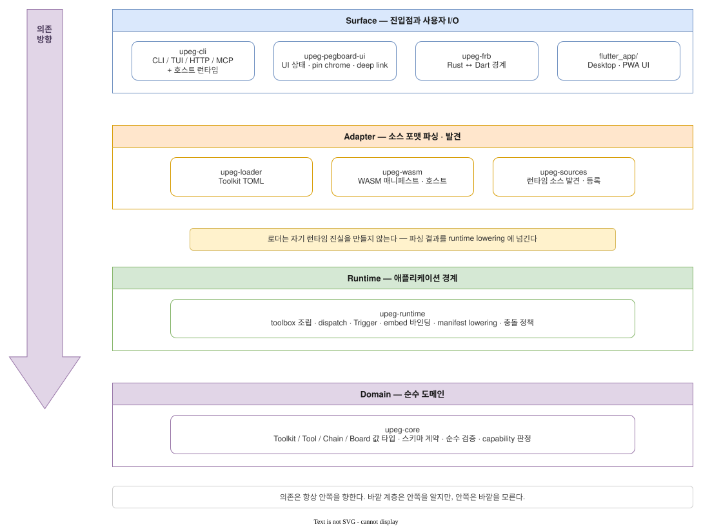
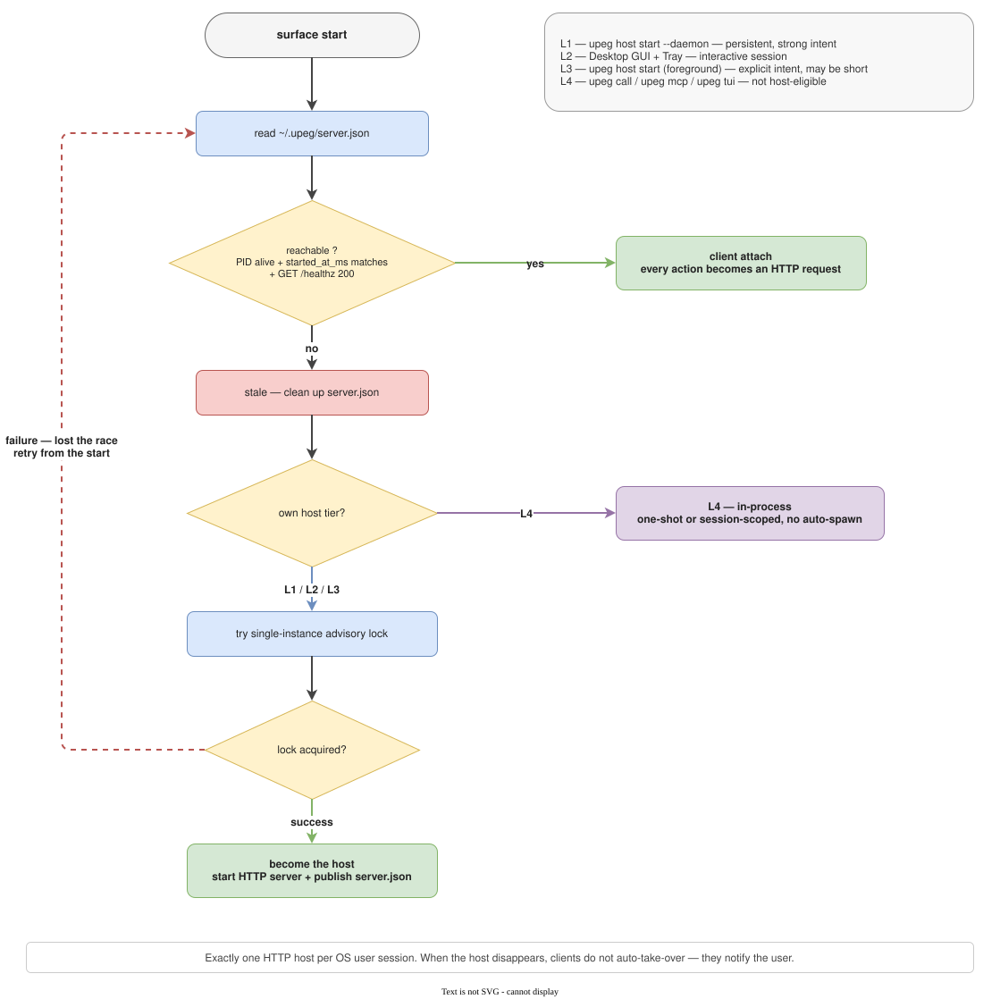
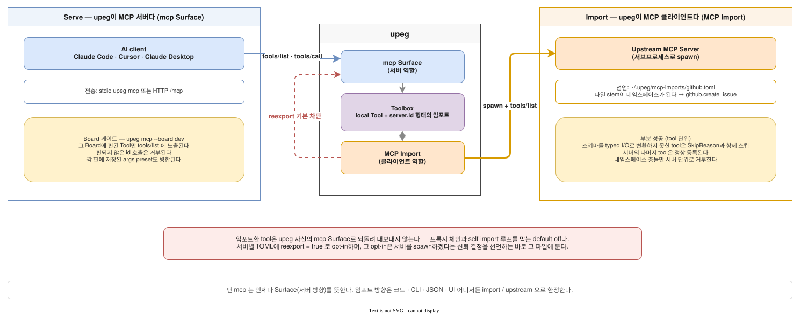

# Architecture

UPeg defines a Tool once — metadata, typed inputs/outputs, an invoker —
and serves it through seven surfaces (CLI, TUI, Desktop, PWA,
Chrome extension, MCP, HTTP). Every non-UI protocol call travels in one
shared envelope. This document keeps the map; the contracts live in each
module's rustdoc.

## Layers

Dependencies always point inward: `surface → adapter → runtime → domain`.



| Layer | Crates | Owns |
|---|---|---|
| Domain | `upeg-core` | Tool/Toolkit/Board value types, schema contracts, pure validation |
| Runtime | `upeg-runtime` | Toolbox overlay, dispatch, triggers, embed binding, lowering, conflict policy |
| Adapter | `upeg-loader`, `upeg-wasm` | Parse source formats, then call runtime lowering |
| Sources | `upeg-sources` | Source discovery/registration: toolkits, project manifest, WASM, MCP imports |
| Surface | `upeg-cli`, `upeg-pegboard-ui`, `upeg-frb`, `flutter_app/` | Entry points, user I/O, the host runtime |

Exactly one surface→surface edge exists: `upeg-frb → upeg-cli`, because the
desktop shell embeds the host instead of spawning it. The layering is
enforced by a test, not a review convention.

Details: `upeg-core/tests/crate_boundaries.rs` module docs

## Toolkit and Tool


```text
Toolkit (grouping/distribution unit, never callable)
└── Tool (call unit; full id is always {toolkit}.{tool})
```

Four sources feed one Toolbox: Static (Rust attribute macros), Declarative
(TOML manifests), WASM (feature-gated), and MCP Import. Every surface
dispatches through the same toolbox + dispatcher boundary. The CLI supports
both `upeg call <toolkit>.<tool>` and the dynamic short form
`upeg {toolkit} {tool}`; both use the same dispatch path.

Invoker kinds (a closed enum): `Function` direct Rust call · `External`
subprocess · `Http` request · `Static` no-op for passive embeds · `Embed`
WebView DOM adapter · `Chain` declarative composition · `Llm`
provider-agnostic LLM call · `Wasm` extism plugin.

Toolkit tags are inherited by every child Tool; Tool tags are additive;
`category` is retired. A Tool's `boards = [...]` only picks an existing
board — boards come from `upeg_core::BUILTIN_BOARDS` or the project
manifest's `[[boards]]`.

Details: `upeg_runtime::toolbox` rustdoc

## Call envelope

CLI, HTTP, MCP, and the other non-UI protocols carry one canonical call: a
Tool id plus JSON arguments. The surface stamps a reserved `_upeg` context
block. Caller-supplied authority fields such as surface, principal, and board
are erased so they cannot be spoofed; only `_upeg.cwd` and
`_upeg.approvedSteps` can survive as caller input on permitted surfaces.
Approval intent is honored only when the stamped principal and surface pass
the Chain approval gate; Ext clears approval intent.
On the CLI, positional arguments bind to declared inputs in manifest
order. `--json`/`--pretty`/`--field` choose a representation of the same
canonical result — never a different result.

Details: `upeg_runtime::execution` rustdoc

## I/O types

Inputs and outputs are declared from a closed set —
`IoType`/`InputKind`/`OutputKind` — identical on all seven surfaces and
serializable to text on the CLI. Inline constraints (`min`/`max`/`regex`,
choices, defaults) attach at the declaration site. Types outside the set
fall back to an iframe/launcher instead of an inline pin.

Details: `upeg_core::input` rustdoc (`IoType` lives in `types`)

## File wire

`File` values cross every surface in one canonical JSON — `name`,
`is_dir`, `mime`, `content`. `bytes` content is padded RFC 4648 Base64;
`directory` content recurses with the same shape:

```json
{
  "name": "hello.txt",
  "is_dir": false,
  "mime": "text/plain",
  "content": { "kind": "bytes", "bytes": "aGVsbG8=" }
}
```

JSON Schema marks File properties with the `x-upeg-file-wire` extension
(v1). Size budgets — decoded bytes, node count, depth, per-request
framing — are fixed in code, and the stricter of tool policy and surface
limit wins.

Details: `upeg_core::input::file_value` rustdoc

## Manifest

Declarative Tools live in TOML manifests: global
`~/.upeg/toolkits/*.toml`, the project `upeg.toml`, and MCP-import
declarations. The authoring reference is
[TOOL_MANIFEST.md](TOOL_MANIFEST.md); the loader validates every manifest
and lowers it into the same runtime contract.

Details: `upeg_loader` crate rustdoc

## Chain

`Chain` composes other Tools declaratively: sequential steps wired by a
small expression grammar (`{input}`, step references, `args_template`
tokens). A gated step stops at an approval barrier authorized by the
caller's surface identity and principal role — never by caller-supplied
booleans. Each step's summary lands in the final envelope.

Details: `upeg_loader::dispatcher::chain` rustdoc

## Surfaces

The same Tool lifecycle renders on the TUI, Desktop, PWA, and the Chrome
extension — layout differs per medium, but verbs, activation, capability
rendering, and approval policy are shared contracts decided once in Rust.

- Seven lifecycle verbs: Open `o` · Run `Enter` · Copy `F2` · Pin `p` ·
  Back `Esc` · Search `/` · Clear `Ctrl`+`U` — `Enter` always means Run.
- Modeless: no edit mode; per-pin keys gate only on focus; `?` renders
  the binding catalog, so cheatsheets cannot drift.
- Activation is inline-first: runnable pins with no required input
  dispatch immediately and render in the pin body; the expanded modal is
  reserved for required inputs, `Chain`/`Llm`, and the explicit Open
  gesture.


- Capability is a closed-enum verdict: `Unsupported` renders as an
  honest notice, never a runnable affordance, and browser surfaces pair
  with a native host to run what they cannot.
- Where supported, approval is a confirmation gesture before dispatch —
  never a form field; live output is an optional stream on top of the single
  final envelope. The extension has no approval gesture and shows a desktop
  handoff for tools that require one.

Details: `upeg_core::keyboard_catalog`, `upeg_core::capability`,
`upeg_frb::api::pin_activation`, `upeg_runtime::{approval, progress}`,
`upeg_core::ux` rustdoc

## Hosts

Shared surfaces talk over HTTP loopback, and `server.json` is the single
source for discovery, auth, and lifecycle. At most one host is
auto-discovered per config root, precedence is deterministic, and no
surface implicitly spawns another — a host starts only on an explicit
decision.

Discovery probes the recorded PID before probing HTTP. A dead PID cannot
authorize attach; its stale record is removed only if the file still matches.
An unknown process state cannot authorize attach or cleanup. A live PID
whose health probe times out retains its record. Clients that reuse a
discovered host recheck that record and PID after connecting, before sending
the bearer token. `started_at_ms` records when UPeg published the file; it
is not an OS process birth time. PID reuse and races between the recheck and
write remain possible, and the HTTP endpoint is not authenticated as a
specific OS process. Pairing therefore still trusts the local discovery
record and loopback environment.

| Tier | Surface | Host eligibility |
|---|---|---|
| L1 | `upeg host start --daemon` | Persistent host until explicit stop |
| L2 | Desktop GUI | Only when "Local HTTP host" is on (default OFF) |
| L3 | `upeg host start` (foreground) | Yes, while it occupies the shell |
| L4 | `upeg call` / `upeg mcp` / `upeg tui` | No — client or in-process |



Details: `upeg_cli::infrastructure::attach` and `upeg_cli::infrastructure::auth` rustdoc

## HTTP

One axum listener serves `/v1/*` REST resources, `/mcp` JSON-RPC
(Streamable HTTP), and an unauthenticated `/healthz`. It binds loopback by
default and requires a bearer token on every route but `/healthz`. Two
token kinds — operator (`server.json`/`UPEG_HTTP_TOKEN`) and agent
(`UPEG_HTTP_AGENT_TOKENS`) — and only operator may claim `cli` or `tui`
origin via `X-Upeg-Origin-Surface`. Lifting a Chain approval barrier also
requires an approval-capable surface.
`POST …/stream` streams a running call as NDJSON. The route inventory is
`GET /v1/openapi.json`, not docs. CORS allows `chrome-extension://` and
loopback origins; arbitrary web origins need an exact-match
`--cors-origin`.

Details: `upeg_cli::surfaces::http` rustdoc

### Extension board routes

The Chrome extension uses `GET /v1/ext/boards`,
`GET /v1/ext/boards/{board}`, and
`POST /v1/ext/boards/{board}/tools/{id}`. These routes expose and call only
pinned, Ext-visible tools through the existing Board builder and dispatcher.
The server stamps the Ext surface; the bearer token still determines the
Operator or Agent role. Neither a request header nor caller-supplied `_upeg`
can claim a different extension identity, and a valid token does not prove
that the caller is a browser extension.

Extension metadata includes declared non-File saved input values and File
field presence, never saved File bytes or resolved Credential values.
Ordinary saved string or JSON inputs are visible to a paired extension;
they are not a secret store. Saved inputs fill the popup form and, after an
explicit in-page Run, the Controlled Embed form. Explicit edits take
precedence, while the Board runtime remains the authority when dispatching.
Tools directly requiring approval under the current manifest policy are
rejected on Ext before dispatch. Nested Chain steps cannot pass a runtime
approval barrier on Ext, but earlier ungated steps may already have run;
Chain execution is not transactional.

## MCP

upeg relates to MCP in both directions. It serves its Toolbox over stdio
(`upeg mcp`, optionally gated to one Board's pins) and over `/mcp` on the
HTTP host, and it imports upstream MCP servers declared in
`~/.upeg/mcp-imports/*.toml` as `<server>.<tool>` namespaces. Imports load
only inside long-lived server processes, reload means restarting the host,
and `reexport = true` opts a server into re-exposure on upeg's own `mcp`
surface. A child-process marker prevents self-import recursion.



Details: `upeg_cli::surfaces` and `upeg_sources::mcp_import` rustdoc

## Security absolutes

These are not trade-off candidates — when a feature conflicts with one,
the feature is dropped.

**Secrets.** A Credential is stored in TOML as a name (a reference) only —
plaintext values never enter manifests, project state, execution logs, or
HTTP/MCP responses. Secret values exist only in the OS keychain or
environment variables and resolve at the execution boundary; they are
never a cloud-sync target. The execution log records metadata only:
timestamp, tool id, invoker, surface, board, status, duration, error
class — never argument values or secrets. Only vetted crypto libraries are
used; no homegrown crypto or vault. Ordinary saved string or JSON input is
user data, not a Credential, and can be returned to a paired extension as
described above.

**Project manifest.** `upeg.toml` detection always checks cwd, including
when it is outside `$HOME`. Inside `$HOME`, it checks ancestors up to
`$HOME`; outside `$HOME`, it checks no ancestors and checks `$HOME` once
as a fallback. This prevents a world-writable ancestor from being loaded
solely because it is above cwd. An absolute `UPEG_PROJECT_MANIFEST_PATH`
selects a manifest explicitly.

**Network.** Interfaces are explicit-start and loopback-first. A
non-loopback bind requires `UPEG_HTTP_ALLOW_NON_LOOPBACK=1` and an
injected token — automatic token generation is forbidden in that mode.
Every HTTP route except `/healthz` requires bearer authentication; the
Host anti-rebinding guard is maintained independently of CORS. Active
interfaces (HTTP on/off, MCP on/off, trigger listeners, remote-bind
consent) are always visible in the status display.

**Embeds.** WebViews run in a separate sandbox. Selector mappings are
explicitly confirmed by the user. A hidden Controlled Embed engine webview
never receives pointer, semantic, or keyboard focus.

Details: `upeg_cli::infrastructure::auth`, `upeg_sources::project` rustdoc

## Stack

Rust workspace for the core and every headless surface; Flutter +
`flutter_rust_bridge` for Desktop/PWA; plain HTML/JS for the Chrome
extension; `extism` (feature-gated) for WASM plugins; axum/tokio for HTTP;
ratatui for the TUI; clap for the CLI; one SQLite store (`upeg.db`) for
shared state. Dependency licenses are gated by `cargo deny`; the
allow-list is `deny.toml` at the repository root — copyleft is rejected.

Details: `deny.toml` header comment
