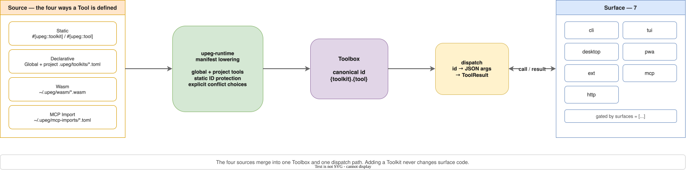

# Hierarchy

```
Toolkit (grouping/distribution unit, not callable)
└── Tool (call unit, always belongs to exactly one Toolkit)
    Full id: {toolkit}.{tool}
```

- A Toolkit id is a distribution/grouping namespace and is never called.
- A Tool's full id is always `{toolkit}.{tool}`. A user's personal tools also live
  under a personal-namespace Toolkit such as `my.script_name`.
- Ids are in canonical form with no padding. Manifests do not normalize
  surrounding whitespace — they reject it.

# Sources

| Source | Method | Unit |
|---|---|---|
| Static | Rust `#[upeg::toolkit]` / `#[upeg::tool]` | Built-in Toolkit compiled into core |
| Declarative | TOML (`~/.upeg/toolkits/{toolkit_id}.toml`, project `upeg.toml`) | One file = one Toolkit |
| Wasm | `.wasm` binary (`~/.upeg/wasm/{toolkit_id}.wasm`) | One binary = one Toolkit |
| MCP Import | Upstream MCP servers declared in `~/.upeg/mcp-imports/*.toml` | One file = one namespace |

# Invoker

The Tool's call mechanism. A closed enum.

| Invoker | Description | Constraints |
|---|---|---|
| `Function` | Direct Rust function call | Static source only. No process needed. |
| `External` | External binary subprocess | Only on hosts that can spawn subprocesses. |
| `Http` | HTTP request | Credential reference + declared URL. |
| `Static` | No call — the Tool presents itself; dispatch is a no-op | `PinKind::Embed` (Passive Embed) only. |
| `Embed` | WebView selector adapter — writes/reads DOM values through CSS selectors | `PinKind::ControlledEmbed` only. Bindings required. |
| `Chain` | Declarative composition of other Tools | Itself a single Tool. |
| `Llm` | LLM API + system prompt | The provider is adapter configuration, not domain. |
| `Wasm` | WASM binary implementing the upeg interface | Requires the extism host (feature-gated). |

`Invoker::Embed` and `PinKind::Embed` are **not** a pair — each pairs with the
other side's counterpart. See the Lexicon's
[confusing pairs](../LEXICON.md#confusing-pairs).

# Tags

- Toolkit-level tags → inherited by every child Tool.
- Tool-level tags → additive.
- Effective tags = `toolkit.tags ∪ tool.tags ∪ toolkit id ∪ capability tags`.
- `category` is retired. Do not add it to manifests, the API, or the UI.

# Board declaration

A Tool's `boards = [...]` only chooses which board tab the Tool sits on; it does
not create the board. The board list comes from two places:

1. The built-in board table — `upeg_core::BUILTIN_BOARDS` (`dev` / `trading` /
   `personal`). Data, not code.
2. **The project manifest's top-level `[[boards]]`** — project-scoped boards
   that exist only while that `upeg.toml` is detected. Declaration, namespacing,
   and persistence rules are in [Project manifest](project-manifest.md) under
   "Project boards".

`~/.upeg/toolkits/*.toml` cannot declare boards — a global Toolkit has no project
to attach a board to. The loader rejects that file's registration outright.

# Dispatch boundary

Every surface calls Tools through one toolbox + dispatcher boundary. There is no
per-surface ad-hoc code.

- `ToolMeta` is pure metadata: id, toolkit, tags, description, schema, pin kind,
  pegboard units, invoker, surfaces, boards.
- `ToolkitMeta` is grouping/distribution metadata.
- The runtime dispatcher is registered by id and receives JSON args.
- A surface gates on `Surface` before running.
- The result is the canonical structured `ToolResult`. CLI stdout picks a
  representation (primary / `--json` / `--field` / `--pretty`); JSON transports
  and UI surfaces consume the same canonical output rows.

## Dispatch order

1. Guarantee built-in dispatcher registration.
2. Check the toolbox has the metadata.
3. If a runtime dispatcher exists, run it.
4. If metadata exists but no dispatcher does, return a clear not-implemented Tool
   error.

Before metadata becomes visible, every accepted invoker must register either an
executable dispatcher or a capability-explicit error.

# Single CLI path

The dynamic route `upeg {toolkit} {tool} <pos...>` is the only path for calling a
Tool. Hardcoded per-Toolkit clap subcommands are not reintroduced, and adding a
Toolkit must not require a CLI change. Binding rules are in
[Call envelope](call-envelope.md).

# Built-in Toolkit ids

`convert`, `text`, `hash`, `id`, `time`, `color`, `security`, `num`, `qr`,
`csv`, `media`, `eth`. See the Lexicon's
[built-in Toolkit id table](../LEXICON.md#built-in-toolkit-ids) for what each id
carries. There is no `timestamp` Toolkit — use `time`.
