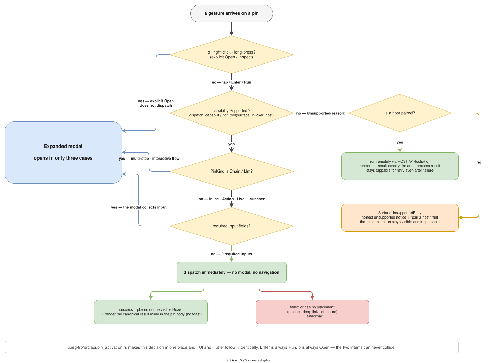

The terminal TUI, the `flutter_app/` Desktop/PWA builds, and the Chrome
extension popup/content script are surfaces of the same Tool lifecycle. Visual
layout differs per medium, but labels, lifecycle verbs, form semantics, and
result-state presentation must stay aligned.

## Desktop Controlled Embed: shared execution and debug

On Desktop, an app-level WebView session service owns one page per Tool id.
Cards and debug modals do not own browser lifetimes. Normal Run and debug
Run/Re-run call the asynchronous Rust dispatcher, and the inputs, bindings,
and settings the dispatcher resolves are passed to the WebView service over an
FRB request stream. A CLI attached to this app's embedded HTTP host uses the
same path.

- Normal runs and debug runs use the same runner's per-binding
  wait/input/trigger/result-read logic. Debug additionally observes the step
  events and selector-check results of the same run.
- Raw strings read from the DOM are normalized in Rust to the declared output
  type, label, and primary output. Debug's final result gets the same
  normalization result and errors.
- Opening Debug alone never runs the Tool or reloads the page. The debug
  screen shows the existing controller and does not end the session when
  closed. One controller attaches to at most one WebViewWidget at a time.
- Normally the app's hidden host keeps the configured viewport. Large pages
  scroll into view so a debug window's size does not change the run viewport.
- Requests for the same Tool run in order. Cancellation blocks follow-up
  operations that have not started; it does not undo a click that already
  ran. A call is not re-run in another browser when the provider exits.
- Sessions live for the app process's lifetime and are recreated when the URL
  or browser settings change. A settings change never swaps the page while a
  run or debug is in flight. Per-Tool pages are not a contract that isolates
  even the cookie store down to separate accounts.

To share Desktop's WebView from the CLI, turn on Desktop's `Local HTTP host`
and launch the app. When a separate CLI host is already running, the existing
discovery rules select that host, and that process does not relay Desktop's
WebView. The local-execution rule for project Tools also still applies.
Sharing in this scope is verified against same-user-toolkit Tools and the
Desktop embedded host.

The WebView service needs the Flutter engine and a native platform host. It
is not a feature that creates a native WebView inside a PWA or supports a
display-less server. The existing headless path of a native CLI with no host
is kept separately.

Linux real-environment regression runs via `just
flutter-controlled-embed-linux-test`. It needs WebKitGTK and Xvfb, and checks
a real WebView's hidden/debug switching plus HTTP calls from a separate CLI
process against a dedicated temporary config root. In ordinary integration
tests the case is skipped when the CLI-verification environment variable is
absent.

This document's path and the four anchors below (`#canonical-lifecycle-verbs`,
`#chrome-extension-contract`, `#display-anatomy`, `#approval-and-live-output`)
are referenced and existence-checked by the interface inventory.

## Canonical lifecycle verbs

| Verb | Meaning | Shared key binding |
| --- | --- | --- |
| Open / Inspect | Show detail, manifest, or modal without dispatching the tool. | `o` (board scope) on keyboard; right-click / long-press → the pin's context-menu "open" entry for mouse/touch (`GestureDetector.onSecondaryTapDown` / `onLongPressStart` in `pin.dart`). |
| Run | Dispatch the selected tool with current arguments. | `Enter` / `Space` from a board item; `F1` in every context that confirms/commits — detail/form/modal, BoardEditor, PinColorEditor, ToolPicker, ConfirmDelete, and the coordinate-move overlay. |
| Copy | Copy current output. | `F2` where an output-bearing modal exposes copy — TUI Result/Detail and the GUI's modal-local F2. |
| Pin | Add a tool to the current board/popup context. | `p` with a focused board item (modeless); `F3` in expanded modal contexts. |
| Back / Close | Leave the current view/modal one level. | `Esc`. `Esc` at the board root is a no-op. TUI `q` closes Detail/Result back to the list, and at the board root opens the quit-confirm dialog. |
| Search | Narrow discovery. | `/` or Cmd/Ctrl+`K`; text input keeps `/` as text and reserves Cmd/Ctrl+`K` for global search. |
| Clear input | Clear the focused text buffer/draft in one step. | `Ctrl`+`U` (TUI Form / BoardEditor / ToolPicker / PinColorEditor). |

`Enter` always means Run and never Open/Inspect, so the two intents cannot collide.

**Headless counterpart.** The same verbs must be usable on a host with no GUI.
The CLI commands for `Pin` / `Coordinate move` are `upeg board <board> pin
<tool> [--units U1|U2|U2T] [--at <row>,<col>]`, `upeg board <board> unpin
<tool>`, and `upeg board <board> move <tool> --at <row>,<col>`, and they use
**the same store, the same reconcile, and the same push-out rules** as the GUI
gestures (`upeg_sources::pegboard`). A pin made by CLI and a pin made by drag
are indistinguishable afterwards. `--at` takes `<row>,<col>` order; the stored
coordinate `(x, y)` is `(col, row)`.

## Canonical Board Keys

| Key | Command |
| --- | --- |
| `←` `↓` `↑` `→` / `h` `j` `k` `l` | Move board focus |
| `b` / `t` | Cycle board / tag filters |
| `1`-`9` / `0` | Switch to board slot / clear board filter where the surface has an all-board state |
| `n` / `R` / `D` | New / rename / delete board — always live (modeless). `D` opens a delete-confirm; a single remaining board can't be deleted. |
| `a` | Open add-tool picker — always live; requires a concrete board (not the all-board state). |
| `p` / `c` | Toggle pin / edit pin color of the focused tool. Gated only on a focused pin. |
| `[` / `]` | Reorder the focused tool. Gated only on a focused pin. |
| `m` then arrows or `h` `j` `k` `l` | Coordinate move of the focused tool; `Enter` commits and `Esc` cancels |
| `e` then arrows or `h` `j` `k` `l` | Resize the focused tool. Gated only on a focused pin, symmetric to `m`. |
| `q` | Quit — opens the quit-confirm dialog |
| `?` | Keyboard cheatsheet — Desktop opens an overlay rendering the shared binding catalog (`upeg_core::binding_catalog`, the data the resolver is tested against, so the sheet can't drift); `Esc` closes it via the shared confirm scope. The TUI keeps its always-visible hint bar instead. |

## Canonical Scoped Keys

| Scope | Key | Command |
| --- | --- | --- |
| Detail / modal | `F1` / `Enter` / `r` | Run |
| Detail / modal | `F2` | Copy latest output when the modal has output (TUI Detail copies the tool id — there is no output yet at this point) |
| Detail / modal | `F3` | Pin current tool |
| Detail / modal | `Esc` / `q` | Close |
| TUI Result | `Enter` / `F1` / `Space` | Re-run the same tool; the previous result stays visible until replaced |
| TUI Result | `F2` | Copy: error message, else primary output text, else canonical JSON of all outputs |
| TUI Result | `Esc` / `q` | Close back to the tool list |
| TUI Result | anything else | Ignored — the result stays as-is |
| BoardEditor / PinColorEditor / ToolPicker / Moving / Resize | `F1` | Commit (alongside `Enter`) |
| Resize | `→` / `l`, `←` / `h` | Grow / shrink the pin one column (clamped to 1..=6 board columns) |
| Resize | `↓` / `j`, `↑` / `k` | Grow / shrink the pin one row (min 1; rows are unbounded) |
| Resize | `0` | Reset to the manifest footprint (drops the span override; follows the board scope's `0` = clear idiom) |
| Resize | `Enter` / `F1` | Commit the new span (growth pushes colliding pins row-major, same reflow as drag-drop) |
| Resize | `Esc` / `q` | Cancel and restore the original span |
| ConfirmDelete / ConfirmQuit | `y` / `Enter` / `F1` | Confirm; `n` / `q` / `Esc` cancel. One generic yes/no scope backs both dialogs. |
| Form | `↓` / `↑` / `Tab` / `Shift+Tab` | Move between fields |
| Settings | `j` / `k` / `Tab` / `Shift+Tab` | Move focus |
| Settings | `h` / `l` / arrows | Change the focused setting row |
| Filter bar / compact tabs | `←` / `→`, `h` / `l`, `Home` / `End` | Move board or tag selection within the focused strip |
| Tool picker / palette | `↑` / `↓`, `Enter`, `Esc` | Move selection, open selected result, cancel |
| Popup / popover menu | arrows or `h` `j` `k` `l`, `Enter`, `Esc` | Move selection, activate, close |

## Modeless invariants

There is no "edit mode" to enter before manipulating boards or pins.

- **Board-management keys are always live.** `n` / `R` / `D` / `a` resolve in board scope
  without any mode; their natural preconditions still apply.
- **Per-pin keys gate only on focus.** `p` / `c` / `m` / `e` / `[` / `]` require a focused
  pin — the single remaining contextual gate.
- **Drag is always available, always from the move handle.** The move handle is visible on
  every pin. Embed / ControlledEmbed pins are draggable **only** by their handle so the live
  body keeps receiving pointer/tap events.
- **Tap = Run.** A plain tap/click runs the pin; inspecting a manifest is the explicit
  `o` / right-click / modal path, never a side effect of tapping.
- **Embed bodies are always live.** There is no static-chip resting state.
- **Destructive and terminal actions sit behind confirm dialogs, not a mode.** Deleting a
  board opens a delete-confirm; quitting the TUI opens a quit-confirm (`q` at the board root).
  `Esc` at the board root does nothing.

## Activation policy (inline-first)

`upeg-frb/src/api/pin_activation.rs` centralises "what happens when a pin is activated"
(tap, `Enter`, or `Run`) so Rust decides once and both surfaces follow.

- **Runnable pins with no required input dispatch immediately.** A runnable pin — `Inline`,
  `Action`, `Live`, or `Launcher` — whose input spec has zero required fields fires right
  away and renders the canonical result **inline in the pin body**. No modal, no navigation.
- **The expanded modal is reserved for:** the same pin kinds when they *do* have required
  inputs, `Chain`/`Llm` pins, and the explicit `o` / Open gesture on any pin — that gesture
  always inspects without dispatching.
- **Snackbars are for errors and unpinned results only.** A successful run of a pin already
  placed on the visible board writes its result inline and shows no toast. A snackbar appears
  when the run failed, or when the activated tool has no on-board placement to render into
  (palette hits, deep-linked or off-board tools).
- **Passive Embed** (`PinKind::Embed`) with a resolvable URL opens the dedicated full-screen
  `EmbedPage` when the tool has no on-board placement; if it is already pinned on the visible
  board, activation focuses the inline embed body instead of navigating away.

## Action pins and honest provider state

- **`memo.create`** is a metadata-declared action (`StaticSource::Shortcut`, chord
  `Cmd+Shift+N`) with no headless dispatcher: activating it creates a new memo and focuses the
  on-board notepad pin so the fresh memo is ready to type into.
- **`memo.scratch`** is a `Live` pin whose inline body is an always-live notepad backed by the
  same memo store.
- **Honest provider state.** A `Live` pin with an `Http` invoker and `Static` source that has
  no configured provider shows a "setup required" badge in place of a runnable affordance.
  Activating it yields a clear provider-not-configured message rather than a generic failure.
  The rule is keyed off invoker/source metadata, so any future "live http, no provider" tool
  is honest by construction.

## Expanded modal forms — bespoke qualification rule

`ExpandedModalPage` mounts a bespoke per-tool form when one is registered for the tool id,
else the generic input form. **A tool qualifies for a bespoke form iff it needs a live preview
— output that updates as the user types, with no run step.** One tool qualifies:
`num.hex_to_decimal` (decode-as-you-type). Everything else stays on the generic form.

The generic form carries the whole declared input contract, so nothing else needs a fork:
field `description` renders as helper text, `String(placeholder=…)` as the hint,
`Number`/`Integer`/`String` defaults seed the field, `Integer(min=…, max=…)` bounds and
`String(regex=…)` patterns validate client-side (Rust stays the enforcer), and choice options
render their `label` (falling back to the value) plus `description`. `Integer` is a distinct
field type from `Number`: integer keyboard, integer parsing, `1.5` rejected.

Non-reasons for a bespoke form, all supplied by the host around the generic form:
`F1` run and `F2` copy are bound for every tool; every result block carries a copy button; a
zero-input tool gets a Run button (the modal's primary button, the inline pin body's Run
button) instead of a dead-end "no inputs" panel.

### `File` input — picking and dropping converge to the same place

`File` is the only kind missing from the list above. Unlike the others it has
two ways to obtain a value, and because the two must produce the same result
the contract is written separately.

| Path | How |
|---|---|
| Pick | The `Choose file` button opens the platform file dialog |
| Drop | The **whole field** is the drop zone. A file arriving highlights the border and background; leaving restores them |

**The two paths converge on the same assembly step.** Policy validation
(allowed extensions, count, per-file and total size) lives in that step, so a
drop can never be looser than the picker. Either path streams the read through
a bounded window and checks the size before opening.

In its empty state the field explains both paths together ("choose a file or
drop it here"). A `File` value travels as bytes, not a filesystem path (the
canonical `FileValue` JSON is the [File wire
contract](architecture/file-wire.md)), so this entire path works unchanged in
the browser build too.

**Multi-select becomes a synthetic directory.** A field with `max_count > 1`
sends the picked files as a list of `directory` entries under a single name.
The shape is decided by the **policy**, not the picked count — with
`max_count == 1` a single file becomes `bytes` directly, while with
`max_count > 1` even one picked file is wrapped in a directory.

The mismatches and gaps, written down honestly:

- **Real directory selection is not supported.** The `directory` above is a
  synthetic container holding multiple files; dropping a folder is refused.
- **`FilePath` is not `File`.** It is a separate kind that takes a path
  string — a text field and a folder button only, not a drop zone.
- **The Chrome extension has no drop path.** The extension uses only the
  native `<input type="file">`. Policy checks exist there too, but the drop
  path itself does not.
- **The field UI does not explain the policy ahead of selection.** There is
  no text stating the allowed extensions, count, or size limits — only the
  `description` is shown. The pickers already take an extension filter through
  Flutter's `allowedExtensions` and the extension's `accept`, and a policy
  violation surfaces as an error message after selection.

## Implementation Boundary

- GUI keyboard policy resolves through the shared Rust scope contract wherever a command exists.
- Flutter-local shortcut handling is reserved for platform/widget activation surfaces with no
  shared command yet: context-menu key opening, output copy, modal pin, embed reload.
- Widget tests use one shared fake keyboard resolver so fixtures do not grow independent
  shortcut tables.

## Embed focus contract

What the Flutter surface enforces once primary focus is inside an editable text field, a View
Embed webview/platform view body, or a ControlledEmbed cockpit form:

- **All keys route to the focused field/body while it holds focus** — not just characters and
  digits, but arrow keys, `Home`/`End`, `PageUp`/`PageDown`, `Backspace`, and `Delete` too, so
  the caret/scroll moves instead of the board paging. The only exceptions are `Cmd`/`Ctrl`
  chords, the scoped `F1`-`F4` commands, and `Esc`.
- **`Tab` performs ordinary focus traversal within the focused subtree**
  (`FocusScope.nextFocus`/`previousFocus`) rather than resolving to a board command.
- **`Esc` is two-stage** inside an embed body or ControlledEmbed form: the first `Esc` is
  focus-return only and dispatches nothing. A second `Esc`, now with board focus, runs the
  normal Back/Close behavior.
- **Passive-embed gate.** Platform webviews frequently don't propagate DOM focus into the
  Flutter focus tree. Whenever the focused pin's tool metadata reports an
  `Embed`/`ControlledEmbed` pin kind, the key-yield rule above applies regardless of what the
  focus tree reports — the gate is keyed off pin metadata, not DOM focus.
- The hidden ControlledEmbed engine — the off-canvas webview that executes the selector
  bindings — must never receive pointer, semantics, or keyboard focus.

## Chrome extension contract

The extension's reason to exist is the page the user is already on. Anything the popup could
only mirror from another pegboard renderer is not where this surface invests.

### Activation routes (`chrome-ext/tool_routing.js`)

`activationRouteFor(tool, { inPageAvailable })` is a pure function of the tool's own metadata
plus one bit of context, and it is closed over exactly three destinations:

| Route | When | What happens |
|---|---|---|
| `IN_PAGE` | pin kind is `ControlledEmbed`, it declares selector bindings, and the active tab is enabled with a live content script | the tool's `SelectorBinding` rows are applied to that tab |
| `DISPATCH` | any other invoker | `POST /v1/tools/{id}` with the pasted bearer token, result rendered inline (immediately when the input schema has no properties, else through an inline form first) |
| `DEEP_LINK` | invoker `static`, or a Controlled Embed with no page to drive | `upeg://open?surface=ext&board=<board>&tool=<tool>` |

`IN_PAGE` is the extension's own answer to Controlled Embed: Desktop drives a webview it owns,
the extension drives the tab. The DOM semantics are the same on both sides — write `.value`
then fire `input`/`change`, click-or-Enter the first declared trigger, read `.value` else
`.textContent` — because `chrome-ext/selector_adapter.js` mirrors
`upeg_runtime::selector_pipeline`.

- When the host is unreachable or the pasted token is rejected, the popup shows a single
  explanatory message with a generic "Open upeg" deep-link fallback. It does **not** silently
  fall back to the per-tool deep link for `DISPATCH` tools; that path is reserved for
  `DEEP_LINK` tools regardless of host reachability.
- An `IN_PAGE` run whose tab turns out to have no content script (the tab predates the
  enablement) reports that inline; it never silently does nothing.

### Per-site enablement (`chrome-ext/site_access.js`)

Which pages the in-page capabilities run on is **stored state, not a manifest constant**. The
manifest asks for `<all_urls>` only as an `optional_host_permissions` entry; the popup's
"Enable on this site" toggle requests the current origin's host permission on demand, adds its
match pattern to `chrome.storage.local`, and the service worker compiles the allow-list into
one `chrome.scripting.registerContentScripts` registration.

- **Only granted patterns are ever registered.** The permission can disappear behind the
  extension's back (the user revokes it in `chrome://extensions`), so every sync filters the
  allow-list through `chrome.permissions.contains` first.
- **etherscan/polygonscan stay pre-enabled.** Their four patterns remain required
  `host_permissions` and are seeded into the allow-list on install, so the migration off the
  hard-coded `content_scripts` block costs a user nothing.
- **Disabling a URL drops every pattern that covers it**, not just the exact one the toggle
  would add — otherwise a seeded `https://*.etherscan.io/*` would keep a subdomain enabled and
  the toggle would look inert.
- Enabling injects into the current tab immediately (`chrome.scripting.executeScript`), because
  a dynamic registration only affects future loads.

### In-page detectors (`chrome-ext/detectors.js`)

Detection is a frozen **table**, not code: a row is a pattern, a label key, an optional host
tool plus the argument name that receives the match, and an optional offline preview. Nothing
else in the extension branches on which detector fired, and adding a detector means adding a
row.

| Row | Host tool | Offline preview |
|---|---|---|
| `hex` (`0x…`) | `num.hex_to_decimal` (`input`) | decimal via `BigInt` |
| `base64` (padded RFC 4648, ≥16 chars) | `convert.base64_decode` (`input`) | none — decoding means validating UTF-8, which is what the tool is for |
| `epoch` (10- or 13-digit) | none | ISO 8601 UTC |

- Matches are wrapped in a `.upeg-mark` span carrying `data-upeg-detector` and a
  `data-upeg-tip` tooltip. A row with a host tool is actionable (`role=button`, `tabindex=0`)
  and resolves **lazily on first hover/focus**; the tooltip then shows the tool's own result.
  With no host reachable it falls back to the offline preview plus the Desktop deep link
  (`upeg://open?surface=ext&board=dev&tool=<tool>&input=<value>`).
- **A row with no host tool is an annotation, not a link.** `epoch` has no upeg tool that
  converts an epoch (`time.epoch_now`/`time.iso_now` take no input), so it renders its preview
  and carries no click affordance — a dead deep link would be worse than plain text.
- Overlaps resolve by row order, so `0xDEADBEEF…` is never read as a base64 blob.

### Trust boundary

A content script's `fetch` is subject to the **page's** CORS, not the extension's host
permissions, so the content script never calls the host and never reads the token. Every host
request is a `upeg:dispatch-tool` message the service worker performs
(`chrome-ext/background.js`), which keeps the bearer token out of every web page's world.

Extension JavaScript stays dependency-free; rich execution remains in Desktop/PWA/host
surfaces.

## PWA offline contract

The `flutter_app/` web build is a PWA that must boot offline. Two files keep
the contract.

- `flutter_app/web/upeg_service_worker.js` — owns the app-shell cache
  (`upeg-app-shell-<release version>`). At install it precaches the document,
  `flutter_bootstrap.js`, and `manifest.json`; navigation requests are
  answered network-first (falling back to the cached document), and every
  other same-origin GET is stale-while-revalidate. The version arrives through
  the registration URL's `?v=`, and `activate` deletes old caches under other
  names — so there is always exactly one shell cache, and a release change
  rebuilds it whole.
- `flutter_app/web/flutter_bootstrap.js` — registers that SW and launches the
  app **only after the SW controls this page**. Only then does everything the
  first load pulls in (`main.dart.js`, CanvasKit, `pkg/upeg_frb*`) land in the
  cache. CanvasKit comes from our own origin too (`canvasKitBaseUrl`), not the
  gstatic CDN — a renderer on someone else's origin cannot be cached, and a
  renderer that cannot be cached makes offline booting impossible.
  Registration happens only in release builds: Flutter fills
  `{{flutter_service_worker_version}}` with `null` on the `flutter run -d
  chrome` dev server, and that signal is used as-is so the dev loop never gets
  stale cached code back.

The `flutter_service_worker.js` Flutter generates is **not registered.** Since
3.29 that file drops caching and becomes a cleanup SW that unregisters itself,
and `flutter build web` does not even have a `--pwa-strategy` flag. Keeping
the offline contract means we have to own the SW.

Verification is `just flutter-web-smoke`
(`scripts/flutter_web_smoke_check.mjs`). Driving headless Chromium over CDP it
asserts that (1) the app shell comes up, (2) `navigator.serviceWorker.ready`
resolves to `upeg_service_worker.js` activated and that SW controls the page,
(3) the app-shell cache holds the whole boot shell, and (4) **with the static
server taken down** a reload still boots from cache. When Chromium is absent
it fails rather than skipping — a missing check must never show up green.

## Capability contract (define once, render honestly)

`upeg-core/src/capability.rs` is the single place that decides whether a Tool can dispatch
**in-process** on the current surface. `dispatch_capability(surface, invoker, host)` is a
closed function of `Invoker` × `RuntimeHost`: `Native` links `upeg-loader` so every invoker
runs; `Wasm` (the Flutter-web/PWA `wasm32` build) links none of it.

`dispatch_capability_for_tool` layers on a per-tool dispatcher probe for the one case the
invoker table cannot see: a `Function` tool whose dispatcher is itself compiled out on this
host (`net.status`, `eth.gas`, `eth.address_lookup`).

- **The probe is keyed on `Invoker::Function`, not trigger `Source`.** Any Function tool —
  `Timer`-sourced or not — produces its value by running a dispatcher, so `eth.gas`
  (a `Launcher`/`UserInput` Function tool) is correctly `NativeOnlyTool` on wasm32. Pure
  Function tools whose dispatcher compiles everywhere (`num.*`, `csv.*`, `qr.encode`) stay
  `Supported`.
- The verdict is a closed enum, never a string: `DispatchCapability::Supported` or
  `Unsupported(UnsupportedReason)`, where `UnsupportedReason` is exactly `NoProcessSpawn`
  (`External` needs a subprocess), `NoLoaderRuntime` (`Http`/`Chain`/`Llm`/`Embed` need
  `upeg-loader`), `NoWasmHost` (`Wasm` needs the extism host), or `NativeOnlyTool` (a
  `Function` tool whose dispatcher needs native-only services, not a loader gap).
- **Surfaces render `Unsupported` as an honest notice, never a runnable affordance.**
  `SurfaceUnsupportedBody` replaces only the pin's rendered body with a static
  "not supported on this surface" body — the pin's declaration stays visible
  and tappable-to-inspect, never hidden and
  never wired to dispatch. The same pattern backs `ProviderNotConfiguredBody` and the
  controlled-embed inline notice.
- `gui_meta`/built-in `surfaces` declarations are audited against this table so a tool never
  claims a surface it cannot run on without explanation.

## Host-attach contract (browser surfaces pairing with a local host)

PWA and chrome-ext are `wasm32`/sandboxed hosts, so **all four** `Unsupported` reasons are
solvable by pairing with a native host: that host links the full loader
(subprocess/http/chain/llm/wasm-plugin) *and* every native-gated `Function` dispatcher
(net/media/eth). `hostAttachCanSolve()` returns `true` for all four.

- **Pairing** is a host address + bearer token entered once in Settings
  (`flutter_app/lib/src/features/host_attach/`); `HostAttachConfig.isConfigured` is simply "a
  non-empty base URL is set". There is no discovery handshake — the token is generated by the
  host and pasted manually, same as the chrome-ext popup's token field. The CLI pairing aid
  (`upeg http status --pairing`) exists so this does not require hand-copying an ephemeral port
  and token; see [Host topology](architecture/host-topology.md).
- When a pin's capability is `Unsupported` and a host is paired, the board routes the tap
  through `POST /v1/tools/{id}` on the paired host (`HttpAttachClient.dispatch`, 8s timeout)
  and renders the remote result exactly like an in-process result. A failed remote attempt
  keeps the pin tappable-to-retry rather than erroring silently.
- When unsupported and no host is paired, the board falls back to `SurfaceUnsupportedBody`
  with a "pair a host" hint.
- If the paired host reports the tool isn't runnable there, the pin shows
  `HostAttachNoticeBody` carrying the host's own error message. The board never hides a
  paired-but-failing attempt behind a generic "unsupported" badge.

CORS, bearer auth, and `/healthz` exposure rules live in [HTTP API](architecture/http-api.md).

## Approval and live output

A run meets a person at two points. **Before the run** there is the approval
barrier; **during the run** there is live output. The medium differs per
surface, but the two contracts are the same.

### Approval gestures

A Chain with a `requires_approval` step demands a person's confirmation before
dispatch. **Before** dispatch, the UI asks `ToolMeta::requires_approval` /
`approval_surfaces` (the FRB `ToolDto`'s `requiresApproval` /
`approvalSurfaces`) "should a confirmation be shown?" and "is my surface's
confirmation honored?", and only after a person confirms does it attach
`approve` — the basis is the surface gate in [Chain Tool](architecture/chain.md).

| Surface | Gesture | When this surface's approval is not honored |
| --- | --- | --- |
| CLI | `upeg call <chain> -a approve=true` | The denial message lists the authorized surfaces |
| TUI | A confirm dialog in front of the run — `Enter`/`F1`/`y` approve, `Esc`/`n`/`q` cancel | Instead of prompting, the result pane writes the reason and the list of authorized surfaces |
| Desktop | A pre-run confirm dialog — run after approval / cancel | The dialog explains the reason and the authorized surfaces instead of approving, and does not dispatch |
| MCP · HTTP · PWA · Ext | None | The manifest must name that surface in `approval_surfaces` |

**The reserved key is made by a confirmation, not by a form.** The TUI puts
`approve` into args only from the confirm dialog's "yes," and desktop receives
`approve` as a typed FRB parameter that Rust attaches — neither args assembled
in Dart nor an args preset stored on a pin can fill the reserved key itself to
claim approval (Rust erases a caller-sent `approve` key first). The point of
this contract is that no path that bypasses a confirmation survives inside the
UI.

### Live output

A Tool that emits output incrementally, like an `External` invoker, streams
chunks while running (`upeg_runtime::with_progress_sink`). One final envelope
is still the contract, and live output is an **optional half** layered on top —
when nobody installs a sink the invoker skips the forwarding work entirely.

| Surface | While running | Cancel |
| --- | --- | --- |
| CLI | Mirrored verbatim to stderr in human-readable modes (`--json`/`--field` stay silent) | `Ctrl+C` |
| TUI | An 8-line tail in the result pane. Dispatch runs on a worker thread so the UI does not freeze. A session attached to a host is the same — chunks arrive verbatim over `POST /v1/tools/{id}/stream` | `Esc` while running. When attached, dropping the response body is itself the cancel signal |
| Desktop | Expanded modal tails the last 8 lines, inline pins the last 3 (monospace) | Cancel button |
| HTTP | NDJSON stream | Dropping the response body |
| MCP | Log notifications | — |

**Cancellation is a request, not a guarantee**
(`upeg_runtime::CancellationToken`). A Tool that does not honor it runs to the
end, and still ends in the single final envelope every surface renders. That
is why the TUI takes `Esc` in two stages while running — once is a cancel
request ("cancelling…"), the second opens the quit-confirm overlay from
[Modeless invariants](#modeless-invariants). A person needs a way out even in
front of an invoker that never checks the token, but two reflexive `Esc`s must
not drop the session either.

**Leaving the screen mid-run does not stop the run — but the two surfaces lose
different things.**

In the TUI, opening quit-confirm and backing away loses the tail, but **the
model keeps holding the run** (`State::active_run`). So Running another Tool
in the meantime does not start a new run — it says what is running and returns
you to that run's pane, where `Esc` is still cancel. The returned pane's tail
is empty: lines discarded on the way out cannot be fabricated.

In desktop, closing the expanded modal is not like that. `run_id` lives in the
modal widget's state, so it dies with the modal — from that moment **the run
cannot be cancelled and its final envelope renders nowhere**. The run itself
still runs to the end and stays in the execution log. Fixing this means
lifting run state out of the modal into a provider — a known gap, not yet
implemented.

## Display anatomy

1. Primary label: `upeg_core::ux::display_label_for(tool.id)`.
2. Secondary metadata: raw technical id (`upeg_core::ux::technical_id`) where space permits.
3. Detail/form metadata: toolkit, effective tags, pin kind, invoker, surfaces, inputs, and
   embed metadata remain visible through surface-appropriate layouts.

## Result semantics

Both surfaces use `upeg_core::ux::result_status_label`: `OK` for successful output, `ERROR`
for tool/dispatch errors.

TUI Result view lifecycle: `Enter`/`F1`/`Space` re-run the same tool rather than dismissing —
the prior result stays on screen until the new outcome replaces it. `Esc`/`q` closes back to
the tool list. Every other key is ignored. `F2` copies with the same fallback precedence the
GUI's copy affordance uses (`CanonicalToolResultView`): the error message if the run failed,
else the primary output's display text, else a canonical JSON dump of all outputs.

Desktop board/pin/theme features are wrappers around this shared lifecycle, not a separate
product model.
